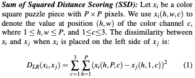
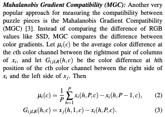
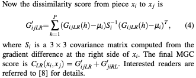
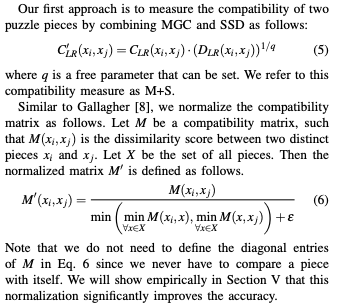
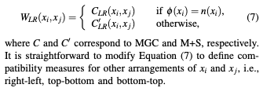
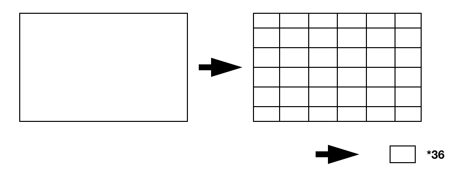
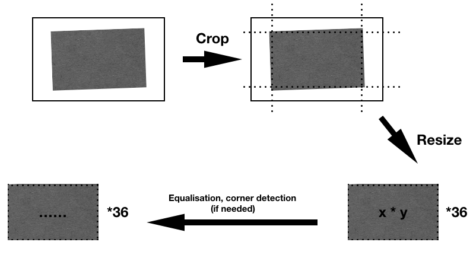
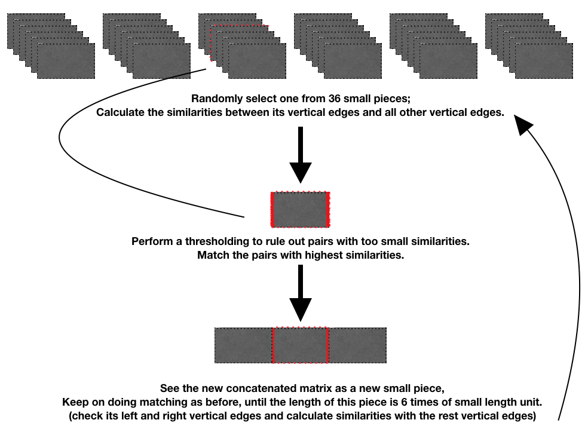
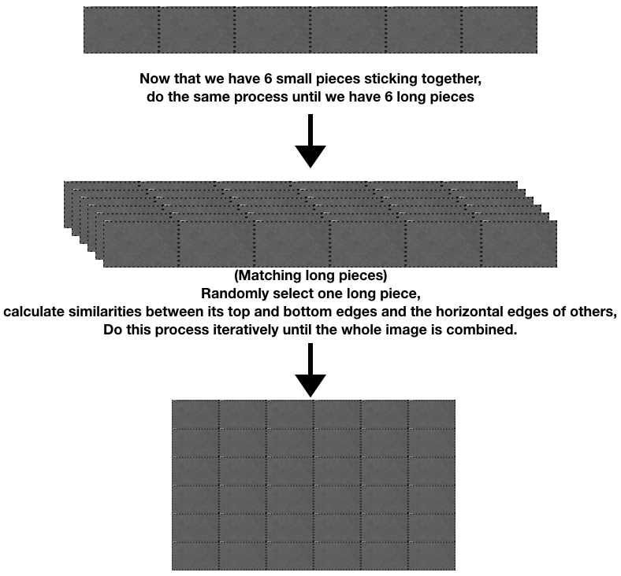

# ENGN4528 project - Jigsaw Puzzle Solver

## To start
Hi there!

This is the initial commit of the project. Let's use this ReadMe file as a notice board.

Project milestones and issues have been updated.
Feel free to explore and add anything you want.

## algorihtm steps based on paper
[Robust Solvers for Square Jigsaw Puzzles]

1. combine MGC and SSD

2. normalize compatibility matrix
3. treat normalized MGC scores as a complete bipartite graph
4. find optimal matching by Hungarian algorithm
5. for each pair, take either MGC or M+S score according to the rule

6. make sure to compute all orientation arrangements in the above steps

## basic skeleton
Here are some meeting conclusions from 24/4 (Wed week 7).

- preparation: choose and print an image, crop by hand, take photos

- pre-processing: crop, resize, equalisation (if needed), corner detection (if needed)

- **matching: compute similarities, match them vertically, then horizontally**

